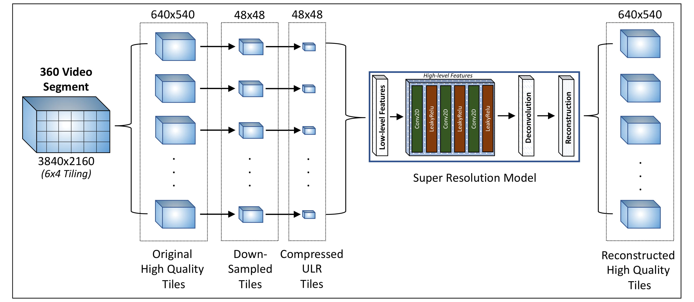

Super Resolution for 360 video streaming
========================================

A Keras and Tensorflow implementation of super resolution using deep neural networks is proposed. The architecture is shown below.

Network Architecture
--------------------

  

Training
-----------

- We divide the video temporal consecutive segments of 1 second duration
- We downsample the images of each segment and feed both downsampled and original image for training
- Each video segment has its own model (we called it as a micro-model because it is trained on a little data of 30 images)
- We overfit the model intentionally as there is no test phase

Prerequisites
-------------

- Python3
- Tensorflow
- Keras
- Jupyter Notebook (optional)

Authors
-------

**Pranjal Sahu, Mallesham Dasari**
